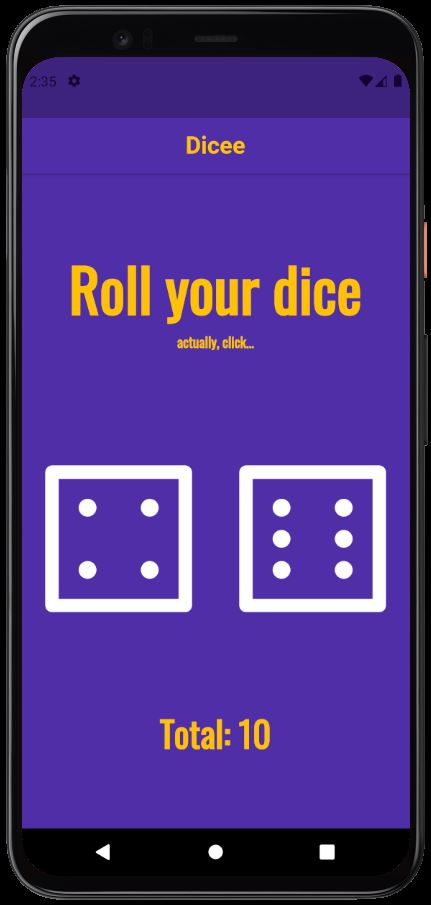

# Dicee App - [](https://flutter.dev/)

<h1 align="center">
  
  <p>🎲A simple Flutter App to roll dice🎲</p>
  
</h1>

# Features

- Single page to roll(click) dice and sum total result

## Getting Started

- Clone the repository
- run in cmd:
  ```cmd
  flutter pub get
  flutter run
  ```

## Dependencieis

| Lib         | Link                                                                  |
| ----------- | --------------------------------------------------------------------- |
| Oswald font | [Google Fonts](https://fonts.google.com/specimen/Oswald?query=oswald) |

## Device

- Tested in Pixel 4 - Android 11
